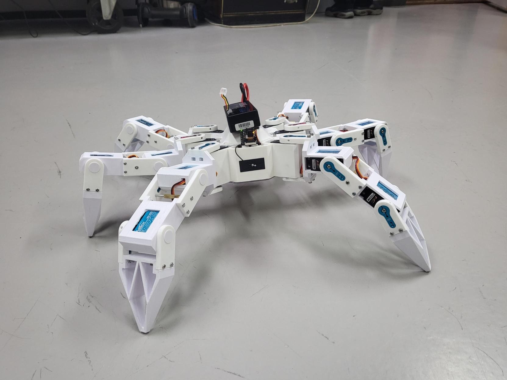

# Dynamic Hexapod Control System

*The hexapod in its natural habitat.*

## Project Overview

This project is a dynamic, 3D-printed, six-legged robot (hexapod) controlled by a XIAO ESP32-S3 Sense microcontroller. It showcases a range of advanced robotics capabilities, including fully independent 6-degrees-of-freedom (DOF) body pose control during locomotion, adaptive speed and gait parameters, and real-time FPV (First-Person View) video streaming from its onboard camera.

Control is achieved through a custom Python PySide6 GUI, facilitating TCP/UDP communication for commands and telemetry. Additionally, the robot can be controlled via the DroidPad mobile application (available on F-Droid) for Android devices, offering an alternative input method.

This system was developed as a graduation project for Göteborgsregionens Tekniska Gymnasium (GTG).

## Key Features

*   **Dynamic Locomotion:** Tripod gait with smooth, continuous motion.
*   **6-DOF Body Pose Control:** Full control over body position (X, Y, Z) and orientation (pitch, roll, yaw) which can be adjusted live, even while walking.
*   **Adaptive Parameters:** Real-time adjustment of maximum speed, acceleration/deceleration, step height, and step time via the GUI.
*   **FPV Camera Streaming:** Live video feed from the onboard camera, viewable through the Python GUI, enabling FPV operation.
*   **Dual Control Interfaces:**
    *   Comprehensive Python PySide6 GUI for detailed configuration, telemetry display, and keyboard control.
    *   DroidPad mobile app (Android, via F-Droid) for joystick and button-based remote control.
*   **Modular Firmware & Software:** Designed with distinct modules for kinematics, walk cycle, network communication, and hardware control.
*   **Network Discovery:** The robot broadcasts its presence on the network, allowing the GUI to easily discover and connect to it.

## Table of Contents

*   [Quick Start Guide](docs/QUICK_START_GUIDE.md) - Get the robot up and running.
*   [Developer's Guide](docs/DEVELOPER_GUIDE.md) - Set up, modify, and understand the code.
*   [Technical Deep Dive: Kinematics & Walk Cycle](docs/TECHNICAL_DEEP_DIVE_KINEMATICS.md) - Understanding the motion system.
*   [Technical Deep Dive: Communication Protocol](docs/TECHNICAL_DEEP_DIVE_COMMUNICATION.md) - How the GUI and robot talk.

## Core Components

### Hardware
*   **Microcontroller:** Seeed Studio XIAO ESP32-S3 Sense (with Grove Shield).
*   **Camera:** Onboard camera of the XIAO ESP32-S3 Sense.
*   **Servo Drivers:** 2x PCA9685 I2C PWM Servo Driver boards.
*   **Servos:**
    *   16x FiTech FT5330M (35kg-cm torque) digital servos (for most joints).
    *   2x FiTech FT5320M (20kg-cm torque) digital servos (for middle leg coxa joints).
*   **Power System:**
    *   1x 2S (7.4V) 5200mAh 100C Hardcase RC LiPo Battery.
    *   **!!! BATTERY WARNING !!!**
        *   **CRITICAL: This robot uses a high-discharge LiPo battery. LiPo batteries can be DANGEROUS if misused, over-discharged, or damaged.**
        *   **The current voltage reading system on the robot is UNRELIABLE/NON-FUNCTIONAL.**
        *   **You MUST periodically check the battery voltage MANUALLY using a LiPo battery checker or multimeter to prevent over-discharging (damaging) the battery. Do not let a 2S LiPo fall below ~6.4V under load, or ~7.0V resting.**
        *   Always use a proper LiPo balance charger.
        *   Store LiPo batteries safely.
        *   Handle with care. Disconnect the battery when not in use or when working on the robot.

### Firmware (ESP32 - C++/Arduino)
*   Manages all hardware interfaces (servos, camera).
*   Implements the walk cycle, inverse kinematics, and body transformations.
*   Handles TCP/UDP network communication for commands and telemetry.
*   Serves the MJPEG video stream via an HTTP server.
*   Manages robot state and configuration.

### Control Software & Apps
*   **Python GUI (`hexapod_gui.py`):**
    *   Built with PySide6.
    *   Provides comprehensive control over robot movement, pose, and gait parameters.
    *   Displays telemetry data received from the robot.
    *   Includes an MJPEG video viewer for the FPV stream.
    *   Manages TCP/UDP communication via `hexapod_comms_client.py`.
*   **DroidPad Mobile App (Android):**
    *   [Available from the F-Droid store.](https://f-droid.org/packages/com.github.umer0586.droidpad)
    *   Allows for joystick-based locomotion and button inputs.
    *   (QR Code to import button layout in `docs/images/droidpad_qr.png`)
    

## Quick Links

*   [**Run the Robot (Quick Start)**](docs/QUICK_START_GUIDE.md)
*   [**Modify the Code (Developer's Guide)**](docs/DEVELOPER_GUIDE.md)
*   [**Technical Deep Dive: Kinematics & Walk Cycle**](docs/TECHNICAL_DEEP_DIVE_KINEMATICS.md)
*   [**Technical Deep Dive: Communication Protocol**](docs/TECHNICAL_DEEP_DIVE_COMMUNICATION.md)

## License

[License to be determined - MIT or Apache 2.0 recommended for open-source hardware/software projects.]

## Acknowledgements

This project was developed as a graduation work for Göteborgsregionens Tekniska Gymnasium (GTG).